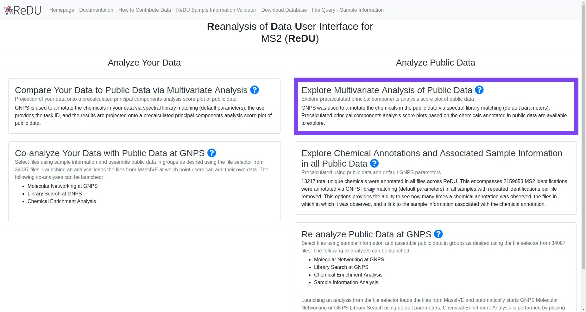
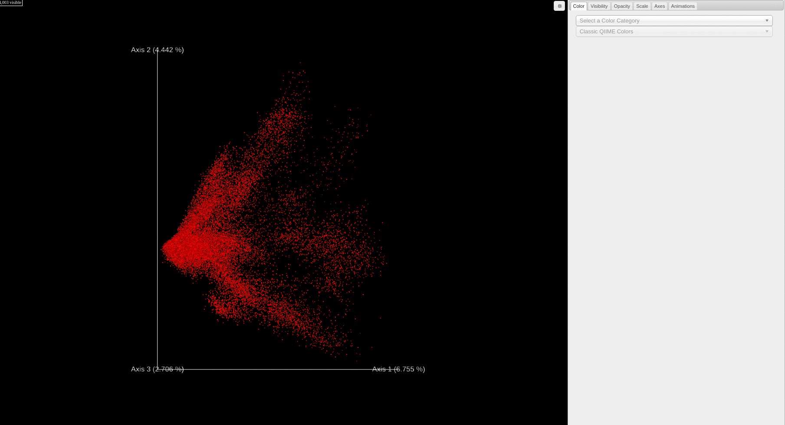

# Analyze Public Data: Explore Multivariate Analysis of Public Data
### Example Use Cases
 * **Explore public data** by comparing the chemicals annotated in samples, analyzed by principal components analysis (PCA), *viz.* human breast milk appears to be most similar to food given their proximity in the PCA score plot.
 * **Begin to explore high-level questions** that remain unanswered when attempting to compare public mass spectrometry data. For example, does urine always look, chemically, like urine year after year, across instruments, across extraction methods, etc?

### Summary
 The common denominator of all mass spectrometry data is the chemicals detected. In spite of the numerous confounders (*e.g.* instrument type, user, year, and extraction method), the chemicals that are detected and annotated from samples is the ground truth of any experiment. The **MS2 data, specifically product ion scans, are extracted from the public data and analyzed *de novo* in GNPS**, and in doing so provide the chemical annotations based on library spectral matching for each file. **Principal components analysis (PCA)** was used to analyze the results in an unsupervised manner. The results are plotted using Emperor which provides interactive plotting capabilities to explore the data via a PCA score plot. Using Emperor, the user has the ability to change the plot axes, color points by sample information, and filter which data point are plotted based on sample information.

### Tutorial
 1. Navigate to the [ReDU-MS2](https://redu.ucsd.edu/) homepage.
 2. Click on the **"Explore Multivariate Analysis of Public Data"** text under the **"Analyze Public Data"** section.

    

 3. Each file is plotted as a point in the PCA score plot. Users can change the PC axes displayed using the drop down.

    

 4. Users can change how the points are colored in the PCA score plot based on a sample information category selected using the drop down menu.

    

 5. Users can filter which samples are plotted in the PCA score plot based on a sample information cateogry using the drop down menu.

    

## Notes:
 * The data are updated periodically and will not display your own data immediately - please use the "Multivariate Comparisons" option under the "Analyze Your Data" if you wish to compare your data to the public data.
