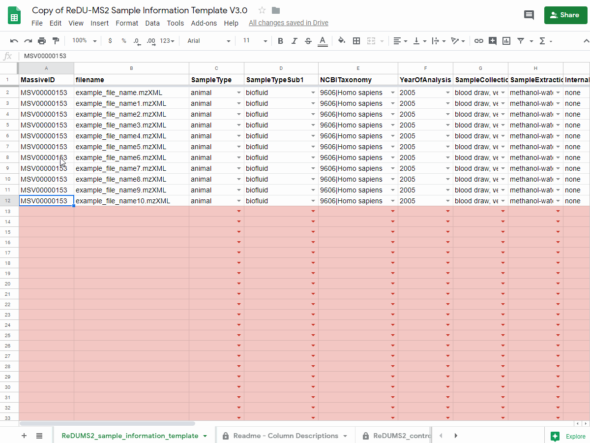
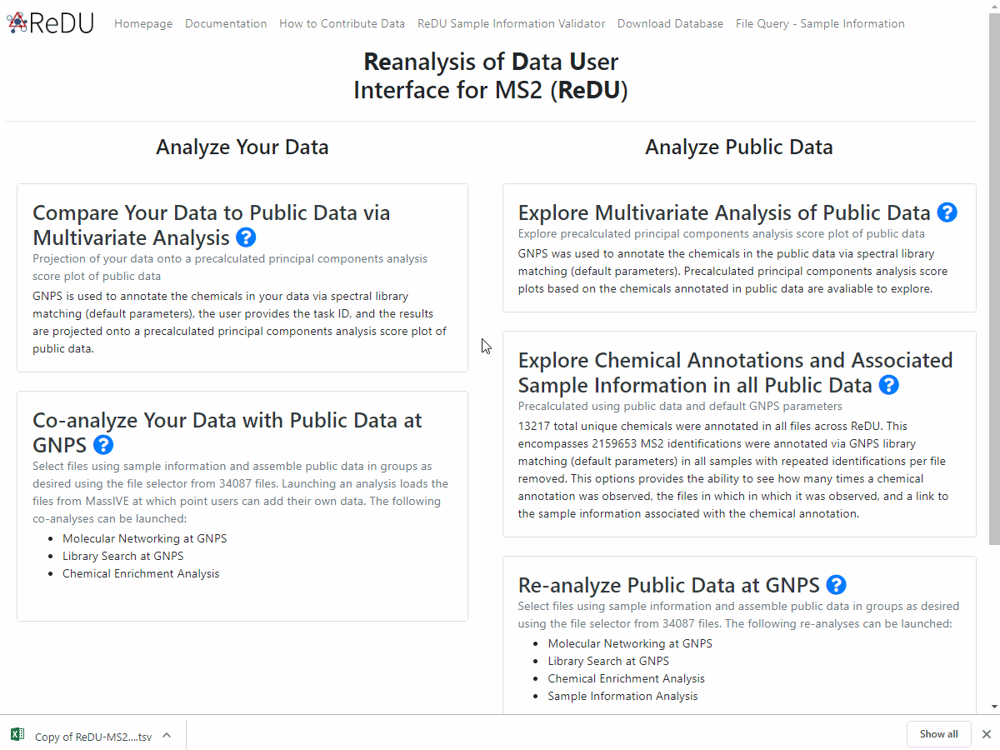

# How to Contribute to ReDU
## Required Items
**> Data (.mzXML or .mzML) uploaded to [MassIVE](https://massive.ucsd.edu/ProteoSAFe/static/massive.jsp) and made public**  
**> ReDU-compliant sample information uploaded to corresponding [MassIVE](https://massive.ucsd.edu/ProteoSAFe/static/massive.jsp) accession**

## Step-by-step Instructions
### Step 1 - Data

#### 1A - Convert to Open-Source File Formats
- Data must be converted to an accepted open-source file format ([file conversion information](https://github.com/CCMS-UCSD/GNPSDocumentation/blob/master/docs/fileconversion.md) and [accepted formats](https://github.com/CCMS-UCSD/GNPSDocumentation/blob/master/docs/isgnpsright.md))

#### 1B - Upload Data to GNPS/MassIVE and Create a MassIVE ID
- Data can be uploaded to [MassIVE](https://massive.ucsd.edu/ProteoSAFe/static/massive.jsp) or [GNPS](https://gnps.ucsd.edu/ProteoSAFe/static/gnps-splash.jsp) using a [FTP client](https://ccms-ucsd.github.io/GNPSDocumentation/fileupload/). A free account is necessary.
- Launch the "Submit your data" workflow ([MassIVE](https://massive.ucsd.edu/ProteoSAFe/static/massive.jsp?redirect=auth)) to create a MassIVE ID
  - **The title must beginning with "GNPS - "**
  - We encourage the upload of vendor-specific raw data, *e.g.* .raw (Thermo) and .d (Bruker and Agilent), in addition to open-source file formats (.mzXML, .mzML, or .mgf).
- You will receive an email when the workflow has completed.
- **Details on dataset creation can be found [here](https://ccms-ucsd.github.io/GNPSDocumentation/datasets/).**

#### 1C - Prepare the MassIVE ID
- The MassIVE ID must be made publicly avaliable by clicking the **"make public"** button.
- Please click the **"convert spectra"** button to expedite inclusion in ReDU.

### Step 2 - Sample Information

#### 2A - Make a copy of the Sample Information Template
- Navigate to the [ReDU Sample Information Template](https://docs.google.com/spreadsheets/d/1v71bnUd8fiXX51zuZIUAvYETWmpwFQj-M3mu4CNsHBU/edit?usp=sharing)
  - **One template is required per MassIVE ID.**
- Save a copy of the sample information template by going to **"File - Make a copy"** into a personal google drive

  
#### 2B - Fill the Sample Information Template
- Fill in sample information using drop-downs when applicable (grey columns at the end of the template are automatically entered using formulae).
  - It is highly recommended to fill the template in Google Sheets to ensure validation.
  - When copying and pasting from another spreadsheet, please **copy + special paste** so as to not chance the cell formulae or formatting.
  - ReDU uses a controlled vocublary - the accepted terms are listed in the "ReDUMS2_controlled_vocabulary" tab per column. **If you require terms that are not avaliable, please raise an issue on [GitHub](https://github.com/mwang87/ReDU-MS2-GNPS).**

#### 2C - Download the Sample Information Template
- When complete, **delete all extra rows** of the template.
- Download from Google Sheets as a tab separated text file using **"File-Download as" and selecting "Tab-seperated values..."**

### Step 3 - Validation

#### 3A - Validate your Sample Information File
- Navigate to the [ReDU Sample Information Validator](https://redu.ucsd.edu/)
- Drag-and-drop or select your sample information file into the validator.
  - A message will indicate if the files passes or not.
  - Non-adherant information is displayed in the "Sample Information Validation Errors" panel - the row, column, and the accepted terms are listed.
- If errors occur, then please correct the non-adherant information in the template and repeat from 2C

#### 3B - Rename the Sample Information File
- Upon passing the validator, **rename the file** to be exactly **"gnps_metadata.tsv"**
  - The filename must be **gnps_metadata.tsv** - this step is critical
  - It is suggested to make a seperate directory on your computer to store each MassIVE IDs sample information template

### Step 4 - Upload the validated Sample Information file named "gnps_metadata.tsv"
- Navigate to the MassIVE ID created
- Click on the **"add files"** button
- Use the Drag-and-Drop upload option to add the validated sample information file named "gnps_metadata.tsv"
- Place the validated sample information file into the **"Supplementary file"** folder and submit the update

## That is it! Double check that your data make it into the [ReDU file selector](https://redu.ucsd.edu/metadataselection).

### Notes
- GNPS/MassIVE is search multiple times per day to find new or updated sample information files so it may take some time for your data to appear.
- If corrections or updates are necessary, please make them accordingly and upload the new validated sample information file named **"gnps_metadata.tsv"**. ReDU will automatically import the most recent version of the "gnps_metadata.tsv" file (files cannot be deleted by users from MassIVE).
- Any conflict between identically named files will result in their exclusion.
- The filename in the sample information file must match the data uploaded to MassIVE (.mzML or .mzXML) - we do not support vendor-specific formats.
