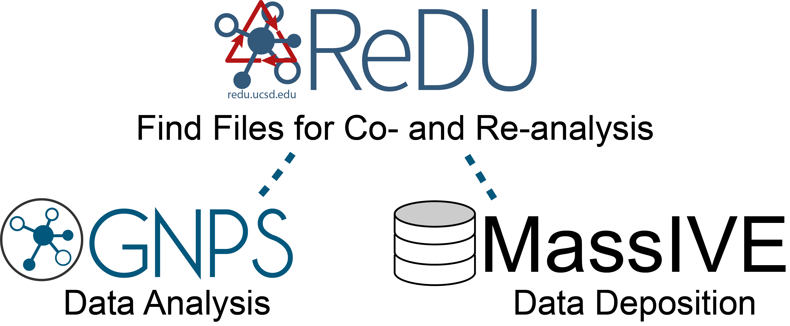

# Welcome to ReDU (Reanalysis of Data User Interface)

## "What is ReDU?"
**Finding and reusing data is hard.** ReDU aims to make that easier. **[ReDU](https://redu.ucsd.edu/)** is a community-minded approach to find and reuse public data containing tandem MS data at the repository scale. ReDU is the bridge between the Global Natural Product Social Molecular Networking Analysis Platform [(GNPS)](https://gnps.ucsd.edu/ProteoSAFe/static/gnps-splash.jsp) and [MassIVE](https://massive.ucsd.edu/ProteoSAFe/static/massive.jsp), a public data repository for mass spectrometry data. The key to making this work is a systemic way of capturing basic information about each file contributed to ReDU (*i.e.* sample information aka metadata). Using the sample information, users can select public data for re-analysis in GNPS or provide their own data along with public data to perform co-analysis. Our aim is to empower researchers to put their data in the context of public data as well as explore questions using public data at the repository scale.

!!! question "How do I contribute to ReDU?"
	**This is a community effort and everyone is encouraged to participate by submitting their own data and sample information [instructions](HowtoContribute.md).**
	The sharing of new applications (and code) which use ReDU is highly encouraged.

---

## Components of ReDU 
1. **ReDU Sample Information**
	- information capture system including a template - [link here](https://docs.google.com/spreadsheets/d/1v71bnUd8fiXX51zuZIUAvYETWmpwFQj-M3mu4CNsHBU/edit#gid=1747621311) - as well as a validator - [link here](https://redu.ucsd.edu/ReDUValidator).
	- a controlled vocabulary and ontologies (e.g. Disease Ontology, Uber Ontology, Mass Spectrometry Ontology) are used.
2. **ReDU File Selector**
	- the ReDU File Selector is the tool that enables users to find files based on ReDU sample information (*i.e.* metadata) and assemble files into cohorts for analysis in GNPS.
	- One can select only public data files in ReDU to perform "re-analysis" **or** one can select public data files in ReDU and add their own data file to perform "co-analysis".
3. **Emperor**
	- Emperor is a visualization tool used to display the results of principal component analysis (PCA) performed on the chemicals annotated in each file in ReDU.
	- Users can explore all files in ReDU **or** project their own data onto the PCA space using a GNPS task ID.
4. **Chemical Explorer**
	- Chemical Explorer enables used to explore the chemicals annotated in ReDU files and their associated sample information (*i.e.* metadata).
5. **GNPS (gnps.ucsd.edu)**
	- GNPS is an analysis platform supporting ReDU.
	- Chemical annotations are performed via GNPS spectral library search (*i.e.* MS/MS spectral library matching)
	- Molecular networking (co- and re-analyses) are performed in GNPS.
6. **MassIVE (massive.ucsd.edu)**
	- MassIVE is the data repository that ReDU utlizes for mass spectrometry data as well as the sample information (*i.e.* metadata).
    
---

## We are developing two main branches of functionality built to re-analyze public data in ReDU or co-analysis of user data with public data in ReDU
- **Repository-scale Molecular Networking via GNPS** - [link here](molecular_networking.md)
- **Chemical Explorer in ReDU** - [link here](chemical_explorer.md)
- **Multivariate Analysis (PCA) visualized via Emperor** - [link here](multivariate_analysis.md)
- **Group Comparator in ReDU** - [link here](group_comparator.md)
- **Annotation by Library Search via GNPS** - [link here](library_search.md)

---

## ReDU Schematic
clicking on the image below launches an interactive version or this link - [link here](https://mermaid-js.github.io/mermaid-live-editor/#/edit/eyJjb2RlIjoiZ3JhcGggVERcbiAgc3ViZ3JhcGggIFxuICAgIEExW1wiRmlsZSBTZWxlY3Rpb24gSW50ZXJmYWNlXCJdXG4gICAgQTJbXCJTZXQgVXAgQ28tQW5hbHlzaXM8YnIvPndpdGggR05QUyBNb2xlY3VsYXIgTmV0d29ya2luZ1wiXVxuICAgIEEzW1wiU2V0IFVwIENvLUFuYWx5c2lzPGJyLz53aXRoIEdOUFMgTGlicmFyeSBTZWFyY2hcIl1cbiAgICBBNFtcIkxhdW5jaCBHcm91cCBDb21wYXJhdG9yXCJdXG4gICAgQTVbXCJMYXVuY2ggQ2hlbWljYWwgRXhwbG9yZXJcIl1cbiAgICBBNltcIkxhdW5jaCBQQ0Egb2YgU2VsZWN0ZWQgRmlsZXNcIl1cbiAgXG4gICAgQTEgLS0-IEEyO1xuICAgIEExIC0tPiBBMztcbiAgICBBMSAtLT4gQTQ7XG4gICAgQTEgLS0-IEE1O1xuICAgIEExIC0tPiBBNjtcblxuICAgIGNsaWNrIEExIFwiaHR0cHM6Ly9yZWR1LnVjc2QuZWR1L21ldGFkYXRhc2VsZWN0aW9uXCJcblxuICBlbmQ7XG5cbiAgc3ViZ3JhcGggIFxuICAgIEIxW1wiQ2hlbWljYWwgRXhwbG9yZXIgSW50ZXJmYWNlXCJdXG4gICAgQjJbXCJWaWV3IEZpbGVzXCJdXG4gICAgQjNbXCJWaWV3IEFzc29jaWF0aW9uc1wiXVxuXG4gICAgQjEgLS0-IEIyO1xuICAgIEIxIC0tPiBCMztcbiAgICBBNSAtLT4gQjE7XG5cbiAgICBjbGljayBCMSBcImh0dHBzOi8vcmVkdS51Y3NkLmVkdS9jb21wb3VuZHNsaXN0XCI7XG4gIGVuZDtcblxuICBzdWJncmFwaCAgXG4gICAgQzFbXCJBbmFseXplIFB1YmxpYyBEYXRhXCJdXG4gICAgQzJbXCJFeHBsb3JlIE11bHRpdmFyaWF0ZTxici8-QW5hbHlzaXMgb2YgUHVibGljIERhdGFcIl1cbiAgICBDM1tcIkNoZW1pY2FsIEV4cGxvcmVyXCJdXG4gICAgQzRbXCJSZS1BbmFseXplIFB1YmxpYzxici8-RGF0YSBhdCBHTlBTXCJdXG5cbiAgICBDMSAtLT4gQzI7XG4gICAgQzEgLS0-IEMzO1xuICAgIEMxIC0tPiBDNDtcblxuICAgIEM0IC0tPiBBMTtcbiAgICBDMyAtLT4gQjE7XG5cbiAgICBjbGljayBDMiBcImh0dHBzOi8vcmVkdS51Y3NkLmVkdS9kaXNwbGF5Z2xvYmFsbXVsdGl2YXJpYXRlXCI7XG4gICAgY2xpY2sgQzMgXCJodHRwczovL3JlZHUudWNzZC5lZHUvY29tcG91bmRzbGlzdFwiO1xuICAgIGNsaWNrIEM0IFwiaHR0cHM6Ly9yZWR1LnVjc2QuZWR1L21ldGFkYXRhc2VsZWN0aW9uXCI7XG4gIGVuZDtcblxuICBzdWJncmFwaCAgXG4gIEQxW1wiQW5hbHl6ZSBZb3VyIERhdGFcIl1cbiAgRDJbXCJDb21vcGFyZSBZb3VyIERhdGE8YnIvPnRvIFB1YmxpYyBEYXRhIHZpYTxici8-TXVsdGl2YXJpYXRlIEFuYWx5c2lzXCJdXG4gIEQzW1wiQ28tQW5hbHl6ZSBZb3VyIERhdGE8YnIvPndpdGggUHVibGljIERhdGEgYXQgR05QU1wiXVxuXG4gIEQxIC0tPiBEMjtcbiAgRDEgLS0-IEQzO1xuXG4gIEQzIC0tPiBBMTtcbiAgY2xpY2sgRDIgXCJodHRwczovL3JlZHUudWNzZC5lZHUvY29tcGFyZW11bHRpdmFyaWF0ZVwiO1xuICBjbGljayBEMyBcImh0dHBzOi8vcmVkdS51Y3NkLmVkdS9tZXRhZGF0YXNlbGVjdGlvblwiO1xuICBlbmQ7XG5cbiAgc3ViZ3JhcGggICBcbiAgRTFbXCJHTlBTXCJdXG4gIEUyW1wiR05QUyBNb2xlY3VsYXI8YnIvPk5ldHdvcmtpbmcgSW50ZXJmYWNlXCJdXG4gIEUzW1wiR05QUyBMaWJyYXJ5PGJyLz5TZWFyY2ggSW50ZXJmYWNlXCJdXG5cbiAgRTEgLS0-IEUyO1xuICBFMSAtLT4gRTM7XG5cbiAgQTIgLS0-IEUxXG4gIEEzIC0tPiBFMVxuXG4gIGNsaWNrIEUxIFwiaHR0cHM6Ly9nbnBzLnVjc2QuZWR1L1Byb3Rlb1NBRmUvc3RhdGljL2ducHMtc3BsYXNoLmpzcFwiO1xuICBjbGljayBFMiBcImh0dHBzOi8vZ25wcy51Y3NkLmVkdS9Qcm90ZW9TQUZlL2luZGV4LmpzcD9wYXJhbXM9JTdCJTIyd29ya2Zsb3clMjI6JTIyTUVUQUJPTE9NSUNTLVNORVRTLVYyJTIyLCUyMmxpYnJhcnlfb25fc2VydmVyJTIyOiUyMmQuc3BlY2xpYnM7JTIyJTdEXCI7XG4gIGNsaWNrIEUzIFwiaHR0cHM6Ly9nbnBzLnVjc2QuZWR1L1Byb3Rlb1NBRmUvaW5kZXguanNwP3BhcmFtcz0lN0IlMjJ3b3JrZmxvdyUyMjolMjJNT0xFQ1VMQVItTElCUkFSWVNFQVJDSC1WMiUyMiwlMjJsaWJyYXJ5X29uX3NlcnZlciUyMjolMjJkLnNwZWNsaWJzOyUyMiU3RFwiO1xuICBlbmQ7IiwibWVybWFpZCI6eyJ0aGVtZSI6ImZvcmVzdCIsInNlY3VyaXR5TGV2ZWwiOiJsb29zZSIsImZsb3djaGFydCI6eyJjdXJ2ZSI6ImJhc2lzIiwibm9kZVNwYWNpbmciOjI1fX19)

[![Mermaid Live](https://mermaid.ink/img/eyJjb2RlIjoiZ3JhcGggVERcbiAgc3ViZ3JhcGggIFxuICAgIEExW1wiRmlsZSBTZWxlY3Rpb24gSW50ZXJmYWNlXCJdXG4gICAgQTJbXCJTZXQgVXAgQ28tQW5hbHlzaXM8YnIvPndpdGggR05QUyBNb2xlY3VsYXIgTmV0d29ya2luZ1wiXVxuICAgIEEzW1wiU2V0IFVwIENvLUFuYWx5c2lzPGJyLz53aXRoIEdOUFMgTGlicmFyeSBTZWFyY2hcIl1cbiAgICBBNFtcIkxhdW5jaCBHcm91cCBDb21wYXJhdG9yXCJdXG4gICAgQTVbXCJMYXVuY2ggQ2hlbWljYWwgRXhwbG9yZXJcIl1cbiAgICBBNltcIkxhdW5jaCBQQ0Egb2YgU2VsZWN0ZWQgRmlsZXNcIl1cbiAgXG4gICAgQTEgLS0-IEEyO1xuICAgIEExIC0tPiBBMztcbiAgICBBMSAtLT4gQTQ7XG4gICAgQTEgLS0-IEE1O1xuICAgIEExIC0tPiBBNjtcblxuICAgIGNsaWNrIEExIFwiaHR0cHM6Ly9yZWR1LnVjc2QuZWR1L21ldGFkYXRhc2VsZWN0aW9uXCJcblxuICBlbmQ7XG5cbiAgc3ViZ3JhcGggIFxuICAgIEIxW1wiQ2hlbWljYWwgRXhwbG9yZXIgSW50ZXJmYWNlXCJdXG4gICAgQjJbXCJWaWV3IEZpbGVzXCJdXG4gICAgQjNbXCJWaWV3IEFzc29jaWF0aW9uc1wiXVxuXG4gICAgQjEgLS0-IEIyO1xuICAgIEIxIC0tPiBCMztcbiAgICBBNSAtLT4gQjE7XG5cbiAgICBjbGljayBCMSBcImh0dHBzOi8vcmVkdS51Y3NkLmVkdS9jb21wb3VuZHNsaXN0XCI7XG4gIGVuZDtcblxuICBzdWJncmFwaCAgXG4gICAgQzFbXCJBbmFseXplIFB1YmxpYyBEYXRhXCJdXG4gICAgQzJbXCJFeHBsb3JlIE11bHRpdmFyaWF0ZTxici8-QW5hbHlzaXMgb2YgUHVibGljIERhdGFcIl1cbiAgICBDM1tcIkNoZW1pY2FsIEV4cGxvcmVyXCJdXG4gICAgQzRbXCJSZS1BbmFseXplIFB1YmxpYzxici8-RGF0YSBhdCBHTlBTXCJdXG5cbiAgICBDMSAtLT4gQzI7XG4gICAgQzEgLS0-IEMzO1xuICAgIEMxIC0tPiBDNDtcblxuICAgIEM0IC0tPiBBMTtcbiAgICBDMyAtLT4gQjE7XG5cbiAgICBjbGljayBDMiBcImh0dHBzOi8vcmVkdS51Y3NkLmVkdS9kaXNwbGF5Z2xvYmFsbXVsdGl2YXJpYXRlXCI7XG4gICAgY2xpY2sgQzMgXCJodHRwczovL3JlZHUudWNzZC5lZHUvY29tcG91bmRzbGlzdFwiO1xuICAgIGNsaWNrIEM0IFwiaHR0cHM6Ly9yZWR1LnVjc2QuZWR1L21ldGFkYXRhc2VsZWN0aW9uXCI7XG4gIGVuZDtcblxuICBzdWJncmFwaCAgXG4gIEQxW1wiQW5hbHl6ZSBZb3VyIERhdGFcIl1cbiAgRDJbXCJDb21vcGFyZSBZb3VyIERhdGE8YnIvPnRvIFB1YmxpYyBEYXRhIHZpYTxici8-TXVsdGl2YXJpYXRlIEFuYWx5c2lzXCJdXG4gIEQzW1wiQ28tQW5hbHl6ZSBZb3VyIERhdGE8YnIvPndpdGggUHVibGljIERhdGEgYXQgR05QU1wiXVxuXG4gIEQxIC0tPiBEMjtcbiAgRDEgLS0-IEQzO1xuXG4gIEQzIC0tPiBBMTtcbiAgY2xpY2sgRDIgXCJodHRwczovL3JlZHUudWNzZC5lZHUvY29tcGFyZW11bHRpdmFyaWF0ZVwiO1xuICBjbGljayBEMyBcImh0dHBzOi8vcmVkdS51Y3NkLmVkdS9tZXRhZGF0YXNlbGVjdGlvblwiO1xuICBlbmQ7XG5cbiAgc3ViZ3JhcGggICBcbiAgRTFbXCJHTlBTXCJdXG4gIEUyW1wiR05QUyBNb2xlY3VsYXI8YnIvPk5ldHdvcmtpbmcgSW50ZXJmYWNlXCJdXG4gIEUzW1wiR05QUyBMaWJyYXJ5PGJyLz5TZWFyY2ggSW50ZXJmYWNlXCJdXG5cbiAgRTEgLS0-IEUyO1xuICBFMSAtLT4gRTM7XG5cbiAgQTIgLS0-IEUxXG4gIEEzIC0tPiBFMVxuXG4gIGNsaWNrIEUxIFwiaHR0cHM6Ly9nbnBzLnVjc2QuZWR1L1Byb3Rlb1NBRmUvc3RhdGljL2ducHMtc3BsYXNoLmpzcFwiO1xuICBjbGljayBFMiBcImh0dHBzOi8vZ25wcy51Y3NkLmVkdS9Qcm90ZW9TQUZlL2luZGV4LmpzcD9wYXJhbXM9JTdCJTIyd29ya2Zsb3clMjI6JTIyTUVUQUJPTE9NSUNTLVNORVRTLVYyJTIyLCUyMmxpYnJhcnlfb25fc2VydmVyJTIyOiUyMmQuc3BlY2xpYnM7JTIyJTdEXCI7XG4gIGNsaWNrIEUzIFwiaHR0cHM6Ly9nbnBzLnVjc2QuZWR1L1Byb3Rlb1NBRmUvaW5kZXguanNwP3BhcmFtcz0lN0IlMjJ3b3JrZmxvdyUyMjolMjJNT0xFQ1VMQVItTElCUkFSWVNFQVJDSC1WMiUyMiwlMjJsaWJyYXJ5X29uX3NlcnZlciUyMjolMjJkLnNwZWNsaWJzOyUyMiU3RFwiO1xuICBlbmQ7IiwibWVybWFpZCI6eyJ0aGVtZSI6ImZvcmVzdCIsInNlY3VyaXR5TGV2ZWwiOiJsb29zZSIsImZsb3djaGFydCI6eyJjdXJ2ZSI6ImJhc2lzIiwibm9kZVNwYWNpbmciOjI1fX19)](https://mermaid-js.github.io/mermaid-live-editor/#/view/eyJjb2RlIjoiZ3JhcGggVERcbiAgc3ViZ3JhcGggIFxuICAgIEExW1wiRmlsZSBTZWxlY3Rpb24gSW50ZXJmYWNlXCJdXG4gICAgQTJbXCJTZXQgVXAgQ28tQW5hbHlzaXM8YnIvPndpdGggR05QUyBNb2xlY3VsYXIgTmV0d29ya2luZ1wiXVxuICAgIEEzW1wiU2V0IFVwIENvLUFuYWx5c2lzPGJyLz53aXRoIEdOUFMgTGlicmFyeSBTZWFyY2hcIl1cbiAgICBBNFtcIkxhdW5jaCBHcm91cCBDb21wYXJhdG9yXCJdXG4gICAgQTVbXCJMYXVuY2ggQ2hlbWljYWwgRXhwbG9yZXJcIl1cbiAgICBBNltcIkxhdW5jaCBQQ0Egb2YgU2VsZWN0ZWQgRmlsZXNcIl1cbiAgXG4gICAgQTEgLS0-IEEyO1xuICAgIEExIC0tPiBBMztcbiAgICBBMSAtLT4gQTQ7XG4gICAgQTEgLS0-IEE1O1xuICAgIEExIC0tPiBBNjtcblxuICAgIGNsaWNrIEExIFwiaHR0cHM6Ly9yZWR1LnVjc2QuZWR1L21ldGFkYXRhc2VsZWN0aW9uXCJcblxuICBlbmQ7XG5cbiAgc3ViZ3JhcGggIFxuICAgIEIxW1wiQ2hlbWljYWwgRXhwbG9yZXIgSW50ZXJmYWNlXCJdXG4gICAgQjJbXCJWaWV3IEZpbGVzXCJdXG4gICAgQjNbXCJWaWV3IEFzc29jaWF0aW9uc1wiXVxuXG4gICAgQjEgLS0-IEIyO1xuICAgIEIxIC0tPiBCMztcbiAgICBBNSAtLT4gQjE7XG5cbiAgICBjbGljayBCMSBcImh0dHBzOi8vcmVkdS51Y3NkLmVkdS9jb21wb3VuZHNsaXN0XCI7XG4gIGVuZDtcblxuICBzdWJncmFwaCAgXG4gICAgQzFbXCJBbmFseXplIFB1YmxpYyBEYXRhXCJdXG4gICAgQzJbXCJFeHBsb3JlIE11bHRpdmFyaWF0ZTxici8-QW5hbHlzaXMgb2YgUHVibGljIERhdGFcIl1cbiAgICBDM1tcIkNoZW1pY2FsIEV4cGxvcmVyXCJdXG4gICAgQzRbXCJSZS1BbmFseXplIFB1YmxpYzxici8-RGF0YSBhdCBHTlBTXCJdXG5cbiAgICBDMSAtLT4gQzI7XG4gICAgQzEgLS0-IEMzO1xuICAgIEMxIC0tPiBDNDtcblxuICAgIEM0IC0tPiBBMTtcbiAgICBDMyAtLT4gQjE7XG5cbiAgICBjbGljayBDMiBcImh0dHBzOi8vcmVkdS51Y3NkLmVkdS9kaXNwbGF5Z2xvYmFsbXVsdGl2YXJpYXRlXCI7XG4gICAgY2xpY2sgQzMgXCJodHRwczovL3JlZHUudWNzZC5lZHUvY29tcG91bmRzbGlzdFwiO1xuICAgIGNsaWNrIEM0IFwiaHR0cHM6Ly9yZWR1LnVjc2QuZWR1L21ldGFkYXRhc2VsZWN0aW9uXCI7XG4gIGVuZDtcblxuICBzdWJncmFwaCAgXG4gIEQxW1wiQW5hbHl6ZSBZb3VyIERhdGFcIl1cbiAgRDJbXCJDb21vcGFyZSBZb3VyIERhdGE8YnIvPnRvIFB1YmxpYyBEYXRhIHZpYTxici8-TXVsdGl2YXJpYXRlIEFuYWx5c2lzXCJdXG4gIEQzW1wiQ28tQW5hbHl6ZSBZb3VyIERhdGE8YnIvPndpdGggUHVibGljIERhdGEgYXQgR05QU1wiXVxuXG4gIEQxIC0tPiBEMjtcbiAgRDEgLS0-IEQzO1xuXG4gIEQzIC0tPiBBMTtcbiAgY2xpY2sgRDIgXCJodHRwczovL3JlZHUudWNzZC5lZHUvY29tcGFyZW11bHRpdmFyaWF0ZVwiO1xuICBjbGljayBEMyBcImh0dHBzOi8vcmVkdS51Y3NkLmVkdS9tZXRhZGF0YXNlbGVjdGlvblwiO1xuICBlbmQ7XG5cbiAgc3ViZ3JhcGggICBcbiAgRTFbXCJHTlBTXCJdXG4gIEUyW1wiR05QUyBNb2xlY3VsYXI8YnIvPk5ldHdvcmtpbmcgSW50ZXJmYWNlXCJdXG4gIEUzW1wiR05QUyBMaWJyYXJ5PGJyLz5TZWFyY2ggSW50ZXJmYWNlXCJdXG5cbiAgRTEgLS0-IEUyO1xuICBFMSAtLT4gRTM7XG5cbiAgQTIgLS0-IEUxXG4gIEEzIC0tPiBFMVxuXG4gIGNsaWNrIEUxIFwiaHR0cHM6Ly9nbnBzLnVjc2QuZWR1L1Byb3Rlb1NBRmUvc3RhdGljL2ducHMtc3BsYXNoLmpzcFwiO1xuICBjbGljayBFMiBcImh0dHBzOi8vZ25wcy51Y3NkLmVkdS9Qcm90ZW9TQUZlL2luZGV4LmpzcD9wYXJhbXM9JTdCJTIyd29ya2Zsb3clMjI6JTIyTUVUQUJPTE9NSUNTLVNORVRTLVYyJTIyLCUyMmxpYnJhcnlfb25fc2VydmVyJTIyOiUyMmQuc3BlY2xpYnM7JTIyJTdEXCI7XG4gIGNsaWNrIEUzIFwiaHR0cHM6Ly9nbnBzLnVjc2QuZWR1L1Byb3Rlb1NBRmUvaW5kZXguanNwP3BhcmFtcz0lN0IlMjJ3b3JrZmxvdyUyMjolMjJNT0xFQ1VMQVItTElCUkFSWVNFQVJDSC1WMiUyMiwlMjJsaWJyYXJ5X29uX3NlcnZlciUyMjolMjJkLnNwZWNsaWJzOyUyMiU3RFwiO1xuICBlbmQ7IiwibWVybWFpZCI6eyJ0aGVtZSI6ImZvcmVzdCIsInNlY3VyaXR5TGV2ZWwiOiJsb29zZSIsImZsb3djaGFydCI6eyJjdXJ2ZSI6ImJhc2lzIiwibm9kZVNwYWNpbmciOjI1fX19)
 
---

## Data Availability
- All data can be downloaded from MassIVE
- All sample information can be downloaded from the ReDU-MS2 homepage by clicking "Download Database".
- The ReDU identification database is publicly available and accessible via [(GNPS)](https://gnps.ucsd.edu/ProteoSAFe/static/gnps-splash.jsp), MSV000084206.

## Code Availability
Code for ReDU can be found on GitHub - [link here](https://github.com/mwang87/ReDU-MS2-GNPS)

!!! cite "Recommended Citation"
	- Preprint - [Repository-scale Co- and Re-analysis of Tandem Mass Spectrometry Data](https://www.biorxiv.org/content/10.1101/750471v1).
	- Peer-reviewed Publication - *pending*

!!! help "Issues and Suggestions"
	- See FAQ - [link here](FAQ.md)
	- Please submit any issues or suggestions via [GitHub](https://github.com/mwang87/ReDU-MS2-GNPS).
	- The use of the [GNPS forum](https://groups.google.com/forum/#!forum/molecular_networking_bug_reports) is encouraged.

## Page Contributions
Alan K. Jarmusch (UCSD), Mingxun Wang (UCSD), Christine M. Aceves (UCSD)
